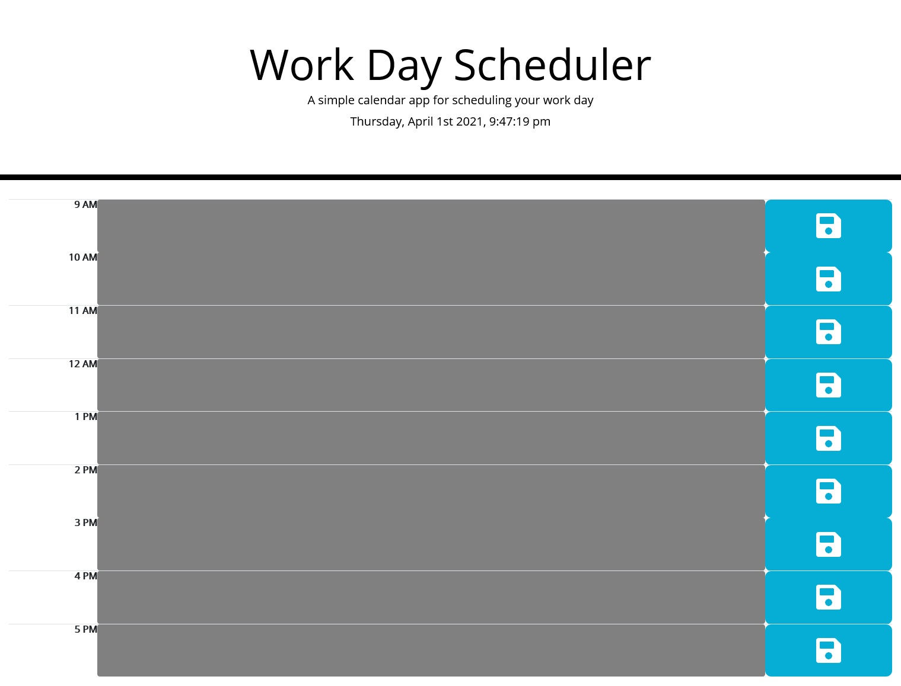

# Work Day Scheduler

## Description

This project is a simple calendar application. The user is able to enter tasks into a text area and save
the contents to local storage when the corresponding icon is clicked. The application will render any 
previously saved text on page load. Textareas are dynamically styled according to time: the current hour 
is highlighted in red, future hours in green, and past hours in gray.

This application applied features from several web APIs for event handling, DOM manipulation, and styling.
Moment.js provides methods for the clock and the current hour as a comparator for text area styling. 
jQuery powers DOM manipulation and event handling. Bootstrap provides a foundation for styling, and the
floppy-disk icon is courtesy of Font Awesome. 

## Table of Contents

- [Usage](#usage)
- [Questions](#Questions)
- [License](#License)

## Usage

Click on the screenshot to launch the application!

## Questions

Questions? Reach out to me:

GitHub: [comatosino](https://github.com/comatosino)

Email: adamsiii.robert@gmail.com

## License
    
This project is covered under the [MIT](https://opensource.org/licenses/MIT) license.
    
## Acknowledgements

Big thank you to these libraries:

- https://api.jquery.com/
- https://momentjs.com/docs/
- https://getbootstrap.com/docs/5.0/getting-started/introduction/
- https://fontawesome.com/
